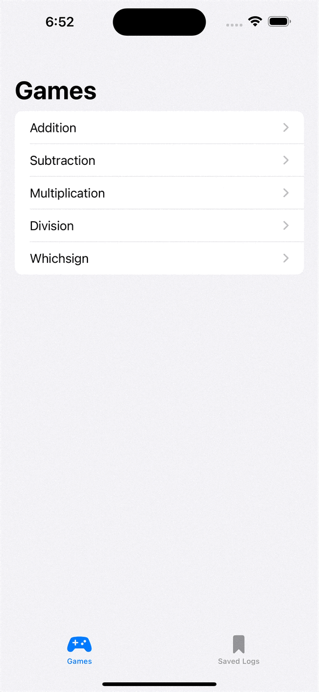
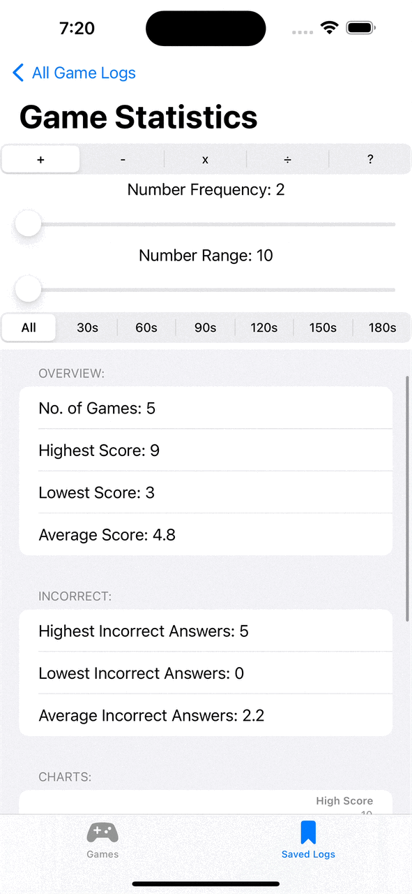
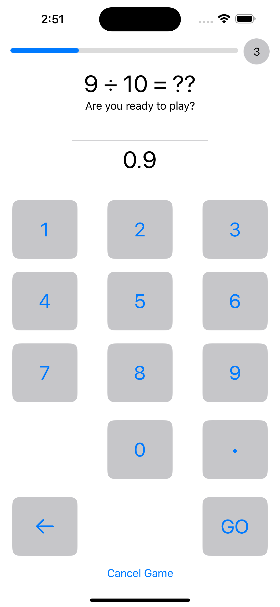
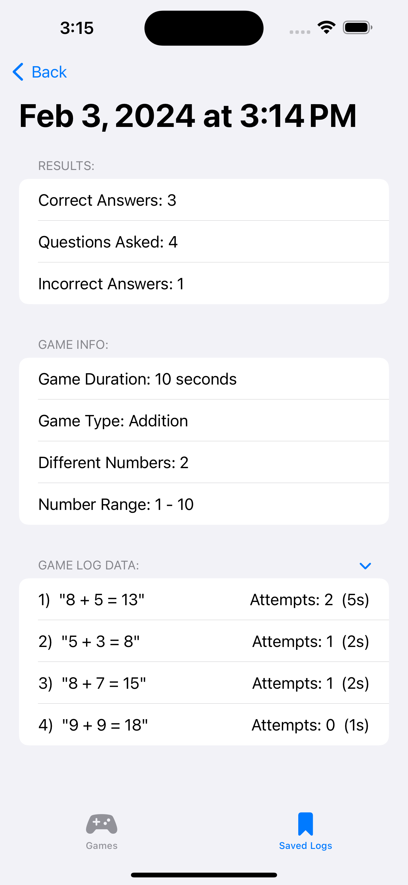
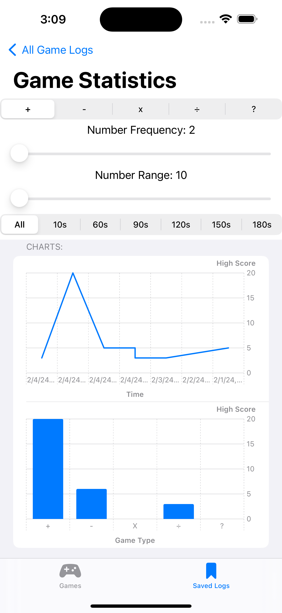
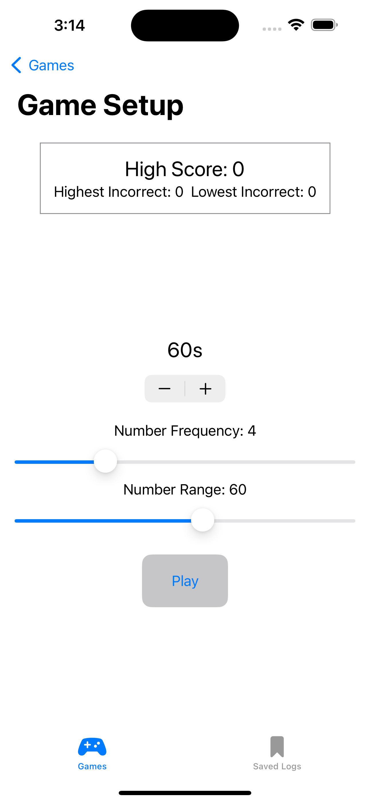
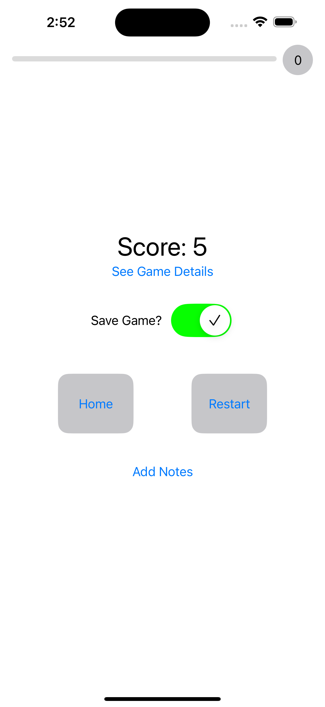

# Quick Maths

<section align="center">
  
  &nbsp;&nbsp;&nbsp;&nbsp;&nbsp;
  
  &nbsp;&nbsp;&nbsp;&nbsp;&nbsp;

</section>

### Overview:

A timed and adjustable arithmetic app that enhances numerical/mathematical proficiency and provides detailed post-game analysis. 

### Use Case:

Designed to enhance mathematical dexterity, users can choose from a variety of game types, each allowing for customisation of variables such as number range and frequency. This capability allows users to hone their skills in unique and interesting ways while receiving comprehensive post-game analysis to track progress and identify areas for improvement. A thorough statistics page offers users complete control over filtering variables, allowing them to tailor their analysis within specific parameters and display their results with intuitive graphical representations. Whether simply for enjoyment, for tracking and evaluating performance over time or for strengthening numerical proficiency, this app is a personalised and indispensable tool for individuals looking to promote mathematical fluency and independent learning.

        
Contents:

        <ul class="overview-section">
        <li><h3><a href="#future-plans">Future Plans</a></h3></li>
        <li><h3><a href="#current-difficulties">Current Difficulties</a></h3></li>
        <li><h3><a href="#past-problems">Past Problems</a></h3></li>
        <li><h3><a href="#screenshots">Screenshots</a></h3></li>
        <li><h3><a href="#licensing">Licensing</a></h3></li>
    </ul>

&nbsp;

# Project Progression

## Future Plans:

#### - <ins>Comprehensive Post-Game Analysis</ins>

#### - <ins>Preset Analysis Parameters</ins>

## Current Difficulties:

## Past Problems:

# Screenshots

<section align="center">
  
  &nbsp;&nbsp;&nbsp;&nbsp;&nbsp;
  
  &nbsp;&nbsp;&nbsp;&nbsp;&nbsp;

</section>
 

&nbsp;&nbsp;&nbsp;&nbsp;&nbsp;

&nbsp;&nbsp;&nbsp;&nbsp;&nbsp;

&nbsp;&nbsp;&nbsp;&nbsp;&nbsp;

  

### Licensing

There is [no license](https://choosealicense.com/no-permission/) associated with this project other than usual GitHub [Terms of Service](https://docs.github.com/en/site-policy/github-terms/github-terms-of-service), however, please be mindful and acknowledge me as the original author if you use significant or distinct portions of this code.
